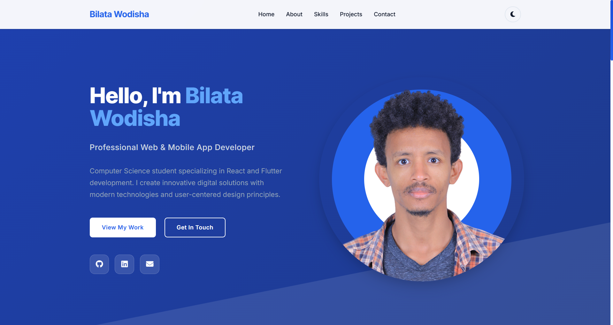

# 🌟 Bilata Wodisha - Professional Portfolio Website

A modern, responsive portfolio website showcasing web and mobile app development skills. Built with clean HTML5, CSS3, and JavaScript featuring an elegant blue theme, dark/light mode toggle, and smooth animations.



## 👨‍💻 About

**Bilata Wodisha** - Professional Web & Mobile App Developer  
Computer Science Student at HiLCoE School of Technology, Ethiopia  
Specializing in Flutter and React.js development

## ✨ Features

### 🎨 **Design & UI**
- **Modern Responsive Design** - Optimized for all devices (desktop, tablet, mobile)
- **Dark/Light Theme Toggle** - Seamless theme switching with localStorage persistence
- **Elegant Blue Color Scheme** - Professional gradient-based design system
- **Smooth Animations** - CSS transitions and scroll-triggered animations
- **Circular Profile Image** - Eye-catching blue gradient ring design

### 🚀 **Functionality**
- **Mobile-First Navigation** - Hamburger menu for mobile devices
- **Smooth Scrolling** - Seamless navigation between sections
- **Interactive Hover Effects** - Enhanced user experience with subtle animations
- **Contact Form** - Ready-to-integrate contact form
- **Social Media Integration** - Direct links to GitHub, LinkedIn, and email

### 📱 **Responsive Breakpoints**
- **Desktop**: 1200px+ (Large screens)
- **Laptop**: 1024px+ (Medium screens)
- **Tablet**: 768px+ (Small screens)
- **Mobile**: 480px+ (Extra small screens)

## 🛠️ Technologies Used

### **Frontend Technologies**
-  **HTML5** - Semantic markup
-  **CSS3** - Modern styling with Grid & Flexbox
-  **JavaScript ES6+** - Interactive functionality

### **Design & Assets**
-  **Font Awesome** - Professional icons
-  **Inter Font Family** - Modern typography

### **Developer Skills Showcased**
- **React.js Ecosystem** - Hooks, Context API, Redux, Next.js
- **Flutter & Dart** - Cross-platform mobile development
- **CSS Frameworks** - Bootstrap, Tailwind CSS, Sass/SCSS
- **Development Tools** - Git, VS Code, Chrome DevTools
- **Backend & Database** - Firebase, Node.js, MongoDB, REST APIs
- **Design Tools** - Figma, Adobe XD, UI/UX Design


## 📁 Project Structure

```
portfolio-website/
├── 📄 index.html              # Main HTML file
├── 🎨 styles.css              # Comprehensive CSS styles
├── ⚡ script-new.js           # JavaScript functionality
├── 📖 README.md               # Project documentation
├── 📂 Images/                 # Image assets
│   ├── 🖼️ profile.png         # Profile picture
│   ├── 📱 addislancerApp.png   # Project screenshots
│   └── 🌐 Portifoilo.png      # Portfolio preview
└── 📂 .git/                  # Git repository files
```

## 🎯 Sections Overview

### **🏠 Hero Section**
- Professional introduction with animated profile image
- Call-to-action buttons linking to projects and contact
- Social media integration (GitHub, LinkedIn, Email)

### **👨‍💻 About Section**
- Personal background and education information
- Development journey and passion statement
- Statistics showcase (Technologies, Experience, Projects)
- Quick info cards (Name, Location, Education, Graduation)

### **🛠️ Skills & Technologies**
- Organized skill categories with professional icons
- Frontend, React Ecosystem, CSS Frameworks
- Mobile Development, Development Tools
- Backend & Database, Design & UI/UX

### **🚀 Featured Projects**
- **Freelancing Mobile App** - Flutter & Firebase
- **React Task Management App** - React Hooks & Context API
- **Personal Portfolio Website** - HTML, CSS, JavaScript
- **Next.js E-commerce Platform** - Full-stack development

### **📞 Contact Section**
- Professional contact information
- Interactive contact form (ready for backend integration)
- Multiple communication channels

## ⚙️ Customization Guide

### **🎨 Theme Colors**
```css
:root {
    --primary-500: #2563eb;    /* Main blue */
    --primary-600: #1d4ed8;    /* Darker blue */
    --bg-primary: #ffffff;     /* Light background */
    --text-primary: #1f2937;   /* Dark text */
}
```


## 📞 Contact

**Bilata Wodisha**
- 📧 Email: [12mastwal@gmail.com](mailto:12mastwal@gmail.com)
- 💼 LinkedIn: [bilata-wodisha-3b5a37143](https://www.linkedin.com/in/bilata-wodisha-3b5a37143/)
- 🐱 GitHub: [billataWo](https://github.com/billataWo/addislancers_app)
- 📍 Location: Addis Ababa, Ethiopia

## 🙏 Acknowledgments

# GODE IS GOOD ALL THE TIME!...


⭐ **If you like this project, please give it a star!** ⭐

*Last Updated: December 2024* 
