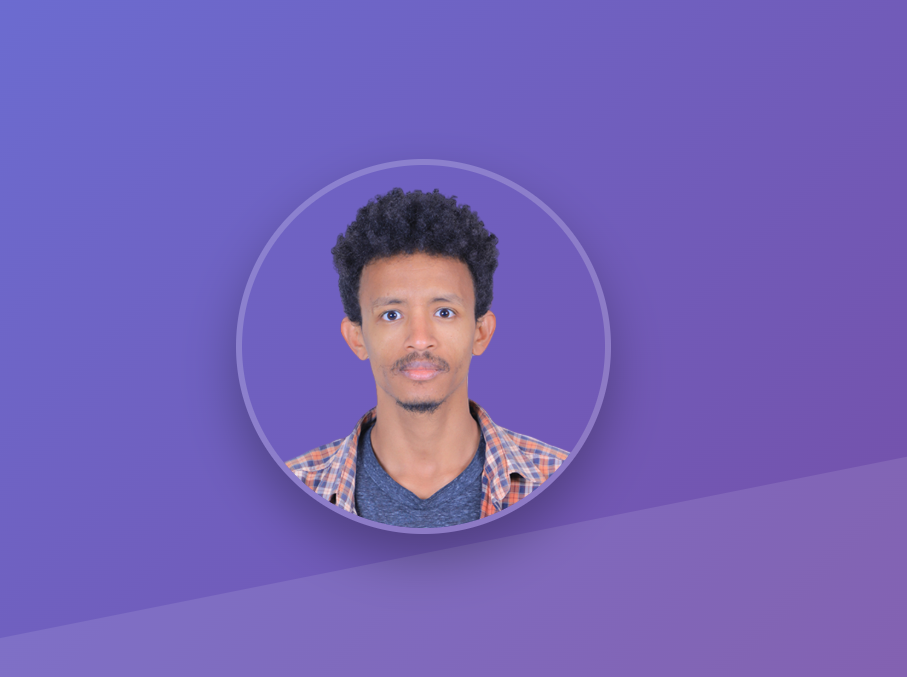

# Bilata Wodisha - Personal Portfolio Website

A modern, responsive personal portfolio website showcasing skills, projects, and experience as a Web and Mobile App Developer. Built with clean HTML5, CSS3, and JavaScript with a focus on performance, accessibility, and user experience.



## 🌟 Features

### 🎨 Design & UI/UX
- **Modern and Clean Design**: Contemporary layout with professional aesthetics
- **Responsive Design**: Fully responsive across all devices (mobile, tablet, desktop)
- **Dark/Light Mode Toggle**: Dynamic theme switching with smooth transitions
- **Smooth Animations**: CSS3 animations and scroll-triggered effects
- **Interactive Elements**: Hover effects, transitions, and micro-interactions

### 🚀 Functionality
- **Single Page Application**: Smooth scrolling navigation between sections
- **Mobile-First Approach**: Optimized for mobile devices with hamburger menu
- **Contact Form**: Professional contact form for client inquiries
- **Social Media Integration**: Direct links to GitHub, LinkedIn, and email
- **SEO Optimized**: Proper meta tags and semantic HTML structure

### 🛠️ Technical Features
- **Pure JavaScript**: No external JavaScript frameworks, lightweight and fast
- **CSS Variables**: Dynamic theming system with CSS custom properties
- **Intersection Observer API**: Efficient scroll animations
- **Local Storage**: Theme preference persistence
- **Modern CSS**: Flexbox, Grid, custom properties, and advanced selectors

## 📁 Project Structure

```
WebProjects/
├── index.html              # Main HTML file
├── styles.css              # Main stylesheet with theme system
├── script-new.js           # JavaScript functionality
├── README.md               # Project documentation
├── Images/                 # Image assets folder
│   ├── profile.png         # Profile/hero section image
│   ├── profile.jpg         # Alternative profile image
│   ├── Addislancer.png     # Freelancing app project screenshot
│   ├── PersonalPortifoilo.png # Portfolio website screenshot
│   └── mobile app.png      # Mobile app project screenshot
└── .git/                   # Git repository files
```

## 🎯 Sections Overview

### 1. **Navigation Bar**
- Fixed header with smooth scrolling navigation
- Theme toggle button (dark/light mode)
- Responsive hamburger menu for mobile devices
- Glass morphism effect with backdrop blur

### 2. **Hero Section**
- Professional introduction with profile image
- Call-to-action buttons
- Social media links (GitHub, LinkedIn, Email)
- Gradient background with modern styling

### 3. **About Section**
- Detailed personal and professional information
- Educational background (HiLCoE School of Technology)
- Professional statistics and achievements
- Personal info cards with icons

### 4. **Skills Section**
- Comprehensive skills showcase organized by categories:
  - **Frontend Web Development**: HTML5, CSS3, JavaScript, TypeScript, React, Angular, Vue.js
  - **React Ecosystem**: React Hooks, Router, Redux, Context API, Next.js
  - **CSS Frameworks**: Bootstrap, Tailwind CSS, Sass/SCSS
  - **Mobile Development**: Flutter, Dart, React Native, Java, Kotlin
  - **Development Tools**: Git, VS Code, Webpack, npm/yarn
  - **Backend & Database**: Firebase, REST APIs, Node.js, MongoDB
  - **Design Tools**: Figma, Adobe XD, UI/UX Design

### 5. **Projects Section**
- **Freelancing Mobile Application**: Flutter app with Firebase backend
- **React Task Management App**: Advanced React application with hooks
- **Personal Portfolio Website**: This current website
- **Next.js E-commerce Platform**: Full-stack e-commerce solution

### 6. **Contact Section**
- Professional contact form
- Contact information (email, phone, location)
- Direct communication channels

### 7. **Footer**
- Copyright information
- Social media links
- Clean and minimal design

## 🚀 Getting Started

### Prerequisites
- Modern web browser (Chrome, Firefox, Safari, Edge)
- Web server (optional, for local development)

### Installation & Setup

1. **Clone the repository**
   ```bash
   git clone <repository-url>
   cd WebProjects
   ```

2. **Ensure image assets are in place**
   - Make sure all images are in the `Images/` folder
   - Required images: `profile.png`, `Addislancer.png`, `PersonalPortifoilo.png`

3. **Open the website**
   - **Option 1**: Open `index.html` directly in your browser
   - **Option 2**: Use a local server (recommended)
     ```bash
     # Using Python 3
     python -m http.server 8000
     
     # Using Node.js (if you have http-server installed)
     npx http-server
     ```

4. **Access the website**
   - Direct file: `file:///path/to/index.html`
   

## 🎨 Customization

### Theme System
The website uses CSS custom properties for easy theme customization:

```css
:root {
    --bg-primary: #ffffff;
    --text-primary: #333333;
    --bg-gradient-start: #667eea;
    --bg-gradient-end: #764ba2;
    /* ... more variables */
}
```

### Adding New Projects
1. Add project image to `Images/` folder
2. Update the projects section in `index.html`
3. Follow the existing project card structure

### Modifying Content
- **Personal Info**: Update content in `index.html`
- **Skills**: Modify skill categories and tags in the skills section
- **Social Links**: Update href attributes in social media links
- **Contact Info**: Update contact details in the contact section

## 📱 Responsive Breakpoints

- **Desktop**: 969px and above
- **Tablet**: 768px - 968px
- **Mobile**: 480px - 767px
- **Small Mobile**: Below 480px

## 🔧 Technologies Used

### Frontend
- **HTML5**: Semantic markup and accessibility
- **CSS3**: Modern styling with variables, grid, flexbox
- **JavaScript (ES6+)**: Modern JavaScript features and APIs

### Libraries & APIs
- **Font Awesome**: Icons and social media icons
- **Google Fonts**: Poppins font family
- **Intersection Observer API**: Scroll animations
- **Local Storage API**: Theme persistence

### Tools & Services
- **Git**: Version control
- **GitHub**: Code repository and potential hosting
- **Browser DevTools**: Development and debugging

## 🌟 Performance Optimizations

- **Lightweight**: No heavy frameworks or libraries
- **Lazy Loading**: Images and content load as needed
- **Efficient Animations**: CSS transforms and transitions
- **Minimal HTTP Requests**: Consolidated assets
- **Semantic HTML**: SEO and accessibility optimized


## 📞 Contact Information

**Bilata Wodisha**
- **Email**: 12mastwal@gmail.com
- **Phone**: +251 799 007 486
- **Location**: Addis Ababa, Ethiopia
- **LinkedIn**: [bilata-wodisha-3b5a37143](https://www.linkedin.com/in/bilata-wodisha-3b5a37143/)
- **GitHub**: [billataWo](https://github.com/billataWo/addislancers_app)


**Built with ❤️ by Bilata Wodisha** | © 2024 All Rights Reserved 